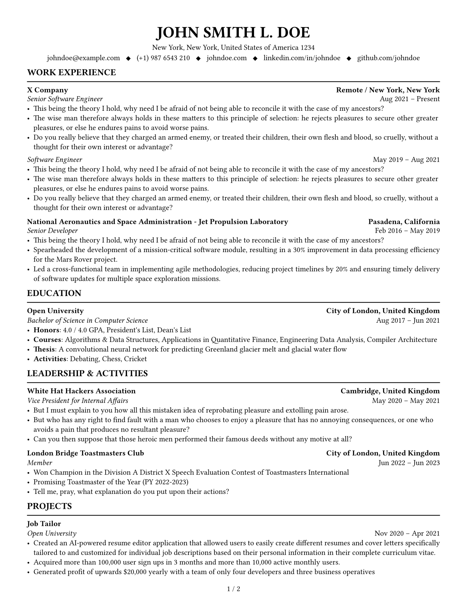
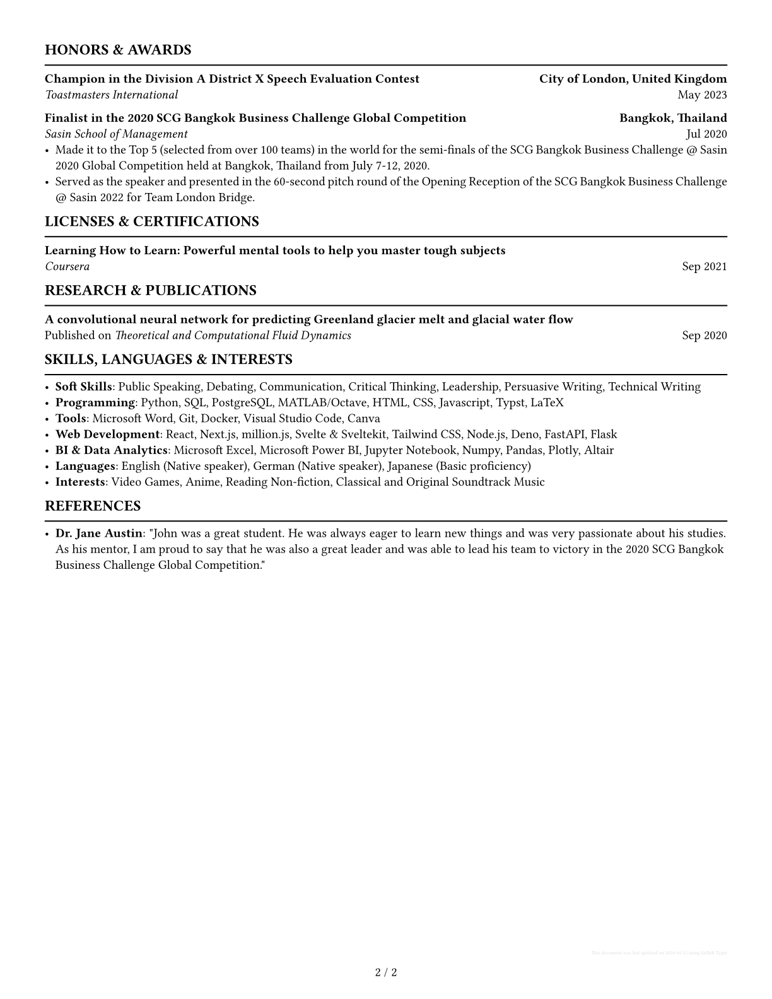

# cv.typ, a Typst CV template

<p align="center">
  <a href="LICENSE">
    
  </a>
</p>

A no-frills curriculum vitae (CV) template for
[Typst](https://github.com/typst/typst) that uses a YAML file for data input in
order to version control CV data easily.

This is based on the [popular template on
Reddit](https://web.archive.org/https://old.reddit.com/r/jobs/comments/7y8k6p/im_an_exrecruiter_for_some_of_the_top_companies/)
by
[u/SheetsGiggles](https://web.archive.org/https://old.reddit.com/user/SheetsGiggles)
and the recommendations of [r/EngineeringResumes
wiki](https://web.archive.org/https://old.reddit.com/r/EngineeringResumes/comments/m2cc65/new_and_improved_wiki).

> [!NOTE]
> Due to circumstances, this project will be minimally maintained and responses
> to issues and pull requests will be delayed. If you would like to contribute
> to this project, I will be happy to review and merge your pull requests when I
> can. Thank you for your understanding.

## Demo

1. Example CV
   <div align="center">
     
     
   </div>

2. [@jskherman's CV](https://go.jskherman.com/cv)

## Usage

`cv.typ` is intended to be used by importing `cv.typ` file from a "template"
file (see [`template/cv-template.typ`](template/cv-template.typ) as an example).
In this content file, call the functions which apply document styles, show CV
components, and load CV data from a YAML file (see
[`template/cv-data.yml`](template/cv-data.yml) as an example). Inside the
content file you can modify several style variables and even override existing
function implementations to your own needs and preferences.

### [Typst CLI](https://github.com/typst/typst) and `git submodule` (Recommended)

The recommended usage with Typst CLI is by adding this `cv.typ` repository as a
[git submodule](https://git-scm.com/book/en/v2/Git-Tools-Submodules). This way,
upstream changes can be pulled easily.

```txt
<your-cv-repo>/
├── cv.typ/ // this repo as git submodule
|   └── cv.typ
├── <your-cv-template>.typ
└── <your-cv-data>.yml
```

1. Add [jskherman/cv.typ](https://github.com/jskherman/cv.typ) as git submodule.
   into your CV's repo.

  ```bash
  git submodule add https://github.com/jskherman/cv.typ
  ```

2. Copy `template/cv-template.typ` and `template/cv-data.yml` to your CV's repo
   root directory. You may rename these files to anything you want. Use these
   files as template/starting point for your CV.

3. In `cv-template.typ`, update `import` statement at line 1 to the following.

  ```bash
  import "cv.typ/cv.typ"
  ```

3. Run the following to command to automatically recompile your CV file on changes.

  ```bash
  typst watch <your-cv-template>.typ
  ```

You may also take a look at [example
setup](https://github.com/jskherman/cv.typ-example-repo) for ideas on how to get
started. It includes a GitHub action workflow to compile the Typst files to PDF
and upload it to Cloudflare R2.

### [typst.app](https://typst.app) web app

1. Upload [`cv.typ`](cv.typ),
   [`template/cv-template.typ`](template/cv-template.typ). and
   [`template/cv-data.yml`](template/cv-data.yml) files to your Typst project. You
   may rename `cv-template.typ` and `cv-data.yml` to anything you want.
2. Use `cv-template` and `cv-data.yml` (or whatever the names after you rename
   it) as a template/starting point for your CV.
